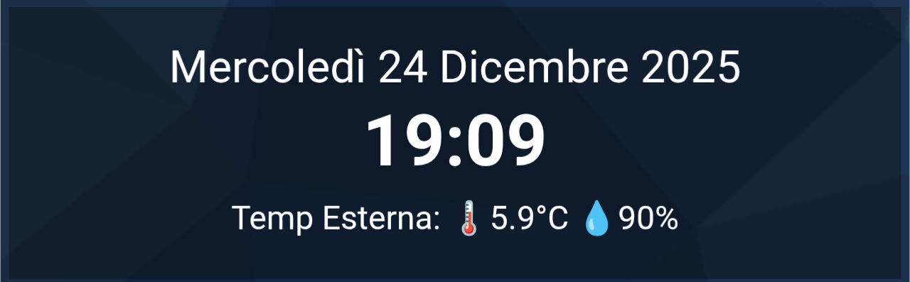

# ⏱️ DomHouse Animated Card

**An elegant animated card for Home Assistant that displays the date, time, and a sensor carousel with a pinball animation.**

## ✨ Features
- Fully customizable Clock and Date.
- Animated Rows: Up to 4 automatically rotating rows.
- Smart Layout: Adapts to 1 or 2 sensors per row.
- Ghost Mode: If a sensor is missing, the row disappears without errors.
- Graphic Editor: 100% visual configuration (no YAML required).
- Customizable: Change size, speed, and transitions directly from the UI.

## 📦 Installation

### HACS (Recommended)
1. Go to HACS > Frontend.
2. Click the 3 dots in the top right > **Custom repositories**.
3. Enter the URL of this repository. https://github.com/SalvatoreITA/domhouse-animated-card
4. Category: **Lovelace**.
5. Click **Add** and then install the card.

### Manual
1. Download `domhouse-animated-card.js`.
2. Upload it to your Home Assistant's `/www/` folder.
3. Add the resource to Dashboard > Three Dots > Edit Dashboard > Manage Resources:
   - URL: `/local/domhouse-animated-card.js`
   - Type: JavaScript Module

## 🔧 Setup
Add a card and search for **"DomHouse Animated Card"**.

### ❤️ Credits
Developed by [Salvatore Lentini - DomHouse.it](https://www.domhouse.it)

