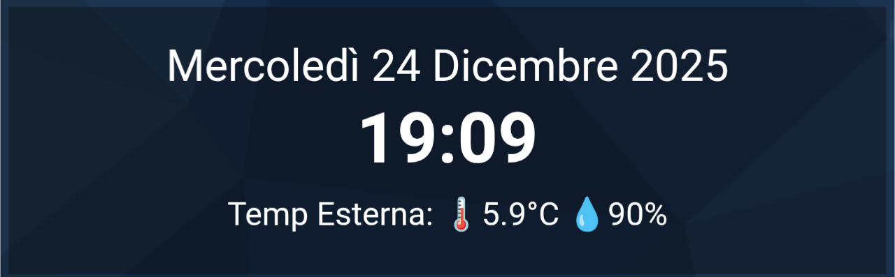

# ⏱️ DomHouse Animated Card

**Una card animata elegante per Home Assistant che mostra Data, Ora e un carosello di sensori con animazione flipper.**

## ✨ Caratteristiche
- **Orologio e Data** completamente personalizzabili.
- **Righe Animate:** Fino a 4 righe che ruotano automaticamente.
- **Smart Layout:** Si adatta se usi 1 o 2 sensori per riga.
- **Ghost Mode:** Se un sensore manca, la riga sparisce senza errori.
- **Editor Grafico:** Configurazione 100% visuale (no YAML necessario).
- **Personalizzabile:** Cambia dimensioni, velocità e transizioni direttamente dalla UI.

## 📦 Installazione

### HACS (Consigliato)
1. Vai su HACS > Frontend.
2. Clicca i 3 puntini in alto a destra > **Custom repositories**.
3. Inserisci l'URL di questa repository. https://github.com/SalvatoreITA/domhouse-animated-card
4. Categoria: **Lovelace**.
5. Clicca **Add** e poi installa la card.

### Manuale
1. Scarica `domhouse-animated-card.js`.
2. Caricalo nella cartella `/www/` del tuo Home Assistant.
3. Aggiungi la risorsa in Plancia > Tre puntini > Modifica Plancia > Gestisci risorse:
   - URL: `/local/domhouse-animated-card.js`
   - Tipo: JavaScript Module

## 🔧 Configurazione
Aggiungi una card e cerca **"DomHouse Animated Card"**.

## ☕ Supporta il Progetto
Ogni piccolo supporto fa un'enorme differenza: mi aiuta a mantenere vivo l'entusiasmo e mi stimola a creare e condividere nuove soluzioni per la community. Grazie di cuore per il tuo aiuto! ❤️🚀

## ❤️ Crediti
Sviluppato da [Salvatore Lentini - DomHouse.it](https://www.domhouse.it)
